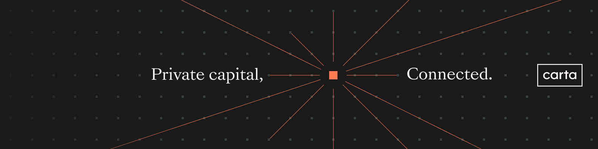

# Carta Plugins

The official repository of Carta plugins for AI Agents, as a [Claude Plugin Marketplace](https://code.claude.com/docs/en/discover-plugins).

## Documentation

Visit the [Carta Developer Platform website here](https://docs.carta.com/api-platform/docs/claude-plugins-setup) for installation and support documentation.

## Plugins

| Plugin | Description |
|--------|-------------|
| [carta-cap-table](plugins/carta-cap-table) | Skills and MCP server for querying Carta cap tables, grants, SAFEs, 409A valuations, waterfall scenarios, and more |
| [carta-fund-admin](plugins/carta-fund-admin) | Skills and MCP server for querying Carta fund admin data, including NAV, performance, allocations, and regulatory reporting |
